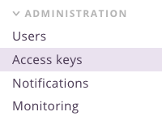
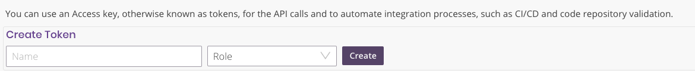
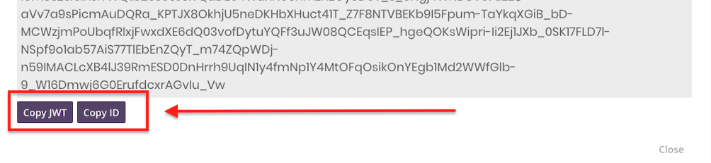

# Validator

Docker image which invokes security script using Octactl


## Configuration:
| Name                       | Description                                                                                        | Required                | Default |
| -------------------------- | -------------------------------------------------------------------------------------------------- | ----------------------- | ------- |
| OCTARINE_ACCOUNT           | Octarine account name                                                                              | Yes                     | None    |
| OCTARINE_SESSION_ID        | Octarine session ID                                                                                | Yes                     | None    |
| OCTARINE_SESSION_ACCESSJWT | Octarine session access JWT                                                                        | Yes                     | None    |
| OCTAINE_POLICY             | Octarine Policy name to use for the validate                                                       | No                      | Default |
| OUTPUT_FILE_PATH           | Path to the output file                                                                            | No                      | None    |
| OBJECT_DIR                 | Directory or file path with the Kubernetes yaml files.                                             | Yes (unless using helm) | None    |
| ALWAYS_DISPLAY_NAMESPACE   | If set output always includes the Namespace field, it will be displayed only if present otherwise. | No                      | False   |
| HELM_COMMAND               | The Helm to use for generating the template see [Using Helm](#using-helm) for details.             | No                      | None    |


### Using Helm 
[Helm](https://helm.sh/) is a package manager running atop Kubernetes. It allows describing the application structure through convenient helm-charts and managing it with simple commands.
In oder to validate a helm chart we will need to render the chart using [helm template](https://v2.helm.sh/docs/helm/#helm-template) and evaluate the output for security risks.
In order for the Validator to render the charts, the full helm command is needed and should be set with `HELM_COMMAND`.


## How to generate Octarine session id
### using octactl:
Login to Octarine with octactl, user must have admin privileges and run the command `octactl access-key create`.
This will create a new long term session key and will return :
```yaml
token_id: <TOKEN_ID>
api_host: main.octarinesec.com
api_port: 443
session:
  accessjwt: <OCTARINE_SESSION_ACCESSJWT>
  id: <OCTARINE_SESSION_ID>
```

### using Octarine UI:
1. Login to [Octarine](https://main.octarinesec.com) web portal.
2. Go to Administration -> Access Keys on the left panel.  

1. Set a name and chose the Read-only on the Create Token fields and click on Create    

4. Use the copy links on the bottom of the pop-up to get JWT and token session id  
